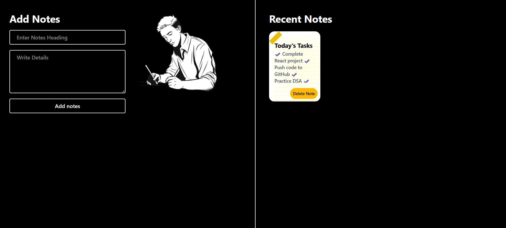

# 📝 Quick Notes

A simple and responsive note-taking application built with **React**, **Vite**, and **Tailwind CSS**. Users can easily create, view, and delete notes through a clean and modern interface.

---

## 🚀 Features

- ✍️ Add new notes with a title and description
- 📋 View all notes instantly
- 🗑️ Delete notes with a single click
- 📱 Fully responsive design
- 🎨 Modern UI using Tailwind CSS
- ⚡ Fast development powered by Vite

---

## 📸 Screenshot

> 
---

## 🛠️ Tech Stack

- React.js
- JavaScript (ES6+)
- Vite
- Tailwind CSS
- Lucide React Icons

---

## 📂 Project Structure

```
Quick-Notes/
├── public/
├── src/
│   ├── assets/
│   ├── App.jsx
│   ├── main.jsx
│   └── index.css
├── package.json
├── vite.config.js
└── README.md
```

---

## ⚙️ Installation

Clone the repository:

```bash
git clone https://github.com/Pratick-Script/Quick-Notes.git
```

Navigate to the project directory:

```bash
cd Quick-Notes
```

Install dependencies:

```bash
npm install
```

Start the development server:

```bash
npm run dev
```

Open your browser and visit:

```
http://localhost:5173
```

---

## 📌 Future Improvements

- 💾 Save notes using Local Storage
- ✏️ Edit existing notes
- 🔍 Search notes
- 🏷️ Add note categories or tags
- 🌙 Dark/Light mode
- 📅 Display creation date and time

---

## 👨‍💻 Author

**Pratick Majhi**

- GitHub: https://github.com/Pratick-Script

---

## 📄 License

This project is licensed under the MIT License.

---

⭐ If you found this project helpful, consider giving it a star on GitHub!